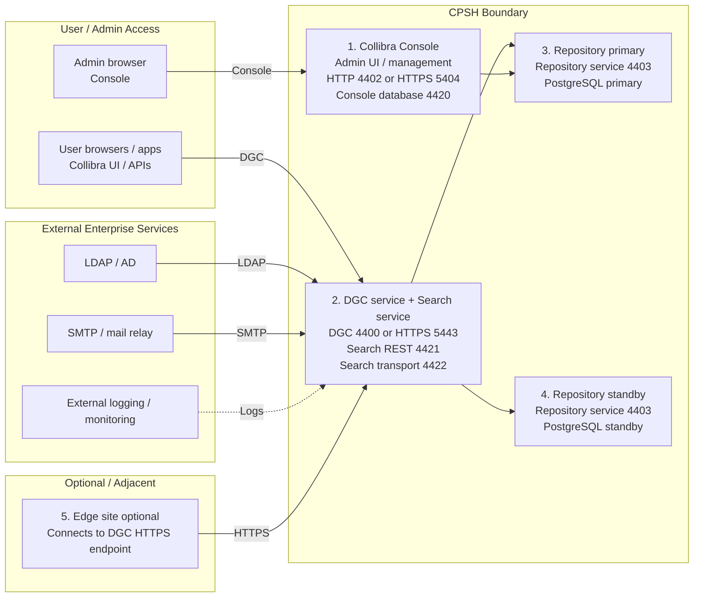

# Collibra CPSH Multi-Node Installation Runbook

This runbook describes a production-oriented multi-node installation of Collibra Platform Self-Hosted (CPSH) with separate nodes for Console, DGC + Search, Repository primary, and Repository standby. It also includes an optional Edge appendix based on the source flow.

The document is written for a FIPS-enabled deployment and uses generic hostnames, passwords, cluster names, and certificate names.

## Scope

This runbook covers:

- host preparation for all nodes
- FIPS enablement
- Console installation
- Repository primary installation
- Repository standby installation
- DGC + Search installation
- HTTPS keystore configuration for Console and DGC
- environment creation in Console
- repository validation
- optional Edge site installation appendix

This runbook does not cover:

- operating system provisioning
- external load balancer setup
- enterprise certificate authority integration
- backup and monitoring implementation details

## Target Architecture



### Default Service Ports

| Service | Port | Notes |
|---|---:|---|
| Management Console HTTP | 4402 | Default Console UI port |
| Management Console HTTPS | 5404 | Recommended if Console uses its own certificate |
| Console database | 4420 | Local Console database port |
| DGC HTTP | 4400 | Default DGC service port |
| DGC HTTPS | 5443 | Recommended if DGC uses its own certificate |
| Agent | 4401 | Used by installed services |
| Repository service | 4403 | Repository service endpoint |
| Search REST | 4421 | Search HTTP endpoint |
| Search transport | 4422 | Search cluster transport |

## Recommended Node Layout

| Node | Role | Suggested FQDN |
|---|---|---|
| Node 1 | Collibra Console | `console.example.internal` |
| Node 2 | DGC + Search | `dgc-search.example.internal` |
| Node 3 | Repository primary | `repo-primary.example.internal` |
| Node 4 | Repository standby | `repo-standby.example.internal` |
| Node 5 | Edge optional | `edge.example.internal` |

## Sizing

### Recommended Multi-Node Production

| Server | Server Size |
|---|---|
| Collibra Console x1 | 2 vCPU, 8 GB RAM, 200 to 300 GB SSD |
| DGC service + Search service x1 | 8 vCPU, 24 GB RAM, 200 GB SSD |
| Repository DB PostgreSQL primary x1 | 4 vCPU, 16 GB RAM, 250 to 500 GB SSD |
| Repository DB PostgreSQL standby x1 | 4 vCPU, 16 GB RAM, 250 to 500 GB SSD |
| Edge site optional x1 | 16 vCPU, 64 GB RAM, 300 GB usable disk |

Notes:

- Edge sizing reflects published minimums for a dedicated single-site k3s-based Edge VM.
- Adjust storage upward for growth, backup staging, logs, and security tooling.

### Larger Production Variant

| Server | Larger Production Size |
|---|---|
| Collibra Console x1 | 4 vCPU, 8 to 16 GB RAM, 300+ GB SSD |
| DGC service + Search service x1 | 12 to 16 vCPU, 32 GB RAM, 300 GB SSD |
| Repository DB PostgreSQL primary x1 | 6 to 10 vCPU, 16 to 32 GB RAM, 500+ GB SSD |
| Repository DB PostgreSQL standby x1 | Same as primary |
| Edge site optional x1 | 16 vCPU, 64 GB RAM, 300+ GB usable disk |

Architecture assumption:

- Node 1 = Console
- Node 2 = DGC + Search
- Node 3 = Repository primary
- Node 4 = Repository standby
- Node 5 = Edge optional

## Prerequisites

Before starting the installer on any node, confirm the following:

- all nodes have stable hostnames
- forward DNS resolution works for every node
- reverse DNS resolution is configured if required by your environment
- NTP or chrony is healthy on every node
- required firewall ports are open between nodes
- the installer archive `dgc-linux-2025.10.394.sh` is staged on each target node
- you have chosen whether Console and DGC will use separate HTTPS certificates
- you have a repository admin password ready: `<repository-admin-password>`
- you have a repository DGC password ready: `<repository-dgc-password>`

### Fill In These Values Before You Start

Replace the placeholders in this runbook with values that fit your environment:

| Placeholder | Example Purpose |
|---|---|
| `<console-fqdn>` | Console hostname, for example `console.example.internal` |
| `<dgc-search-fqdn-or-routable-ip>` | DGC + Search node address used by the installer |
| `<repo-primary-private-ip>` | Repository primary private address |
| `<repo-standby-private-ip>` | Repository standby private address |
| `<repository-admin-password>` | Repository admin password set during repository install |
| `<repository-dgc-password>` | Repository DGC password set during repository install |
| `<console-keystore-password>` | Console HTTPS keystore password |
| `<dgc-keystore-password>` | DGC HTTPS keystore password |
| `<platform-admin-password>` | DGC administrator password used for Edge onboarding |

### Firewall Matrix

| Source | Destination | Port | Purpose |
|---|---|---:|---|
| Admin workstation | Console | 4402 or 5404 | Console UI |
| User clients | DGC | 4400 or 5443 | Platform UI and APIs |
| DGC + Search | Repository primary | 4403 | Repository access |
| DGC + Search | Repository standby | 4403 | Repository access |
| Repository primary | Repository standby | 5432 or replication path as required | PostgreSQL replication |
| All Collibra service nodes | Each other as needed | 4401 | Agent communication |
| Search local services | DGC + Search node | 4421, 4422 | Search runtime |
| Optional Edge | DGC | 5443 | Edge to DGC HTTPS |

## Installation Order

Follow this order:

1. Prepare all nodes
2. Install Console
3. Install Repository primary
4. Install Repository standby
5. Install DGC + Search
6. Configure HTTPS for Console and DGC
7. Create the repository cluster and environment in Console
8. Validate repository primary and standby roles
9. Install optional Edge only after core CPSH is healthy

## 1. Prepare All Nodes

### Enable FIPS Mode

Run on every CPSH node:

```bash
sudo fips-mode-setup --enable
sudo reboot
```

After reboot:

```bash
sudo fips-mode-setup --check
update-crypto-policies --show
```

Expected result:

- FIPS mode is enabled
- the active crypto policy reflects your approved system baseline

### Create the `collibra` User and Host Limits

Run on every CPSH node:

```bash
sudo useradd -m -s /bin/bash collibra

sudo tee /etc/security/limits.d/collibra.conf >/dev/null <<'EOF'
collibra soft nofile 65536
collibra hard nofile 65536
collibra soft nproc 4096
collibra hard nproc 4096
collibra soft fsize unlimited
collibra hard fsize unlimited
collibra soft as unlimited
collibra hard as unlimited
EOF

sudo tee /etc/sysctl.d/99-collibra.conf >/dev/null <<'EOF'
vm.max_map_count = 262144
EOF

sudo sysctl --system
```

### Validate Hostname, DNS, and Time Sync

Run on every CPSH node:

```bash
hostnamectl set-hostname <fqdn>
hostnamectl
getent hosts <fqdn>
timedatectl status
chronyc tracking || true
```

## 2. Install Collibra Console

Node:

- `console.example.internal`

References:

- Collibra CPSH server preparation
- Collibra Console installation guidance

### Install PostgreSQL 14 for Console

```bash
yum clean all && yum update -y
yum -y install https://download.postgresql.org/pub/repos/yum/reporpms/EL-$(rpm -E %{rhel})-x86_64/pgdg-redhat-repo-latest.noarch.rpm
dnf repolist --all | grep -i pgdg
dnf config-manager --set-disabled pgdg18
dnf config-manager --set-disabled pgdg17
dnf config-manager --set-enabled pgdg14
dnf clean all
dnf -y update
yum -y install postgresql14 postgresql14-server postgresql14-contrib
```

Update PostgreSQL tmpfiles configuration:

```bash
vi /usr/lib/tmpfiles.d/postgresql-14.conf
```

Set:

```text
d /run/postgresql 2777 postgres postgres - -
```

Reboot if needed, then verify:

```bash
stat -c '%a %U %G %n' /run/postgresql
```

Initialize and start PostgreSQL:

```bash
echo 'LC_ALL="en_US.UTF-8"' >> /etc/locale.conf
/usr/pgsql-14/bin/postgresql-14-setup initdb
systemctl enable postgresql-14
systemctl start postgresql-14
```

Edit `/var/lib/pgsql/14/data/postgresql.conf` and set at minimum:

```text
max_connections = 500
shared_buffers = 256MB
```

Restart PostgreSQL:

```bash
systemctl restart postgresql-14.service
```

### Install Console Component

```bash
cd /tmp
chmod a+x dgc-linux-2025.10.394.sh
./dgc-linux-2025.10.394.sh -- --fips
```

Use these installer selections:

- Data Governance Center: `n`
- Repository: `n`
- Jobserver: `n`
- Search: `n`
- Management Console: `Y`
- PostgreSQL 14 path: default `/usr/pgsql-14`
- Management Console port: `4402`
- Management Console database port: `4420`

Validate Console service:

```bash
/opt/collibra/console/bin/console status
```

## 3. Configure Console HTTPS

If Console and DGC use different hostnames, use separate certificates and keystores.

Run on `console.example.internal`:

```bash
sudo -u collibra mkdir -p /opt/collibra_data/console/tmp
sudo chmod 700 /opt/collibra_data/console/tmp
sudo -u collibra mkdir -p /opt/collibra_data/console/tmp/bcfips-native
sudo chmod 700 /opt/collibra_data/console/tmp/bcfips-native
```

Switch to the `collibra` user:

```bash
sudo -iu collibra
export CONSOLE_HOST="console.example.internal"
export CONSOLE_KEYSTORE_PASS="<console-keystore-password>"
export BC_LIBS="/opt/collibra/security/fips/libs/bc-fips.jar:/opt/collibra/security/fips/libs/bcutil-fips.jar:/opt/collibra/security/fips/libs/bcpkix-fips.jar"
```

Create a BCFKS keystore:

```bash
rm -f /opt/collibra_data/console/security/console-https.bcfks
mkdir -p /opt/collibra_data/console/security

/opt/collibra/jre/bin/keytool -genkeypair \
  -alias console-https \
  -keyalg RSA -keysize 3072 \
  -sigalg SHA384withRSA \
  -dname "CN=${CONSOLE_HOST}" \
  -ext "SAN=dns:${CONSOLE_HOST}" \
  -validity 825 \
  -keystore /opt/collibra_data/console/security/console-https.bcfks \
  -storetype BCFKS \
  -storepass "${CONSOLE_KEYSTORE_PASS}" \
  -keypass "${CONSOLE_KEYSTORE_PASS}" \
  -providername BCFIPS \
  -providerpath "${BC_LIBS}" \
  -providerclass org.bouncycastle.jcajce.provider.BouncyCastleFipsProvider \
  -J-Djava.io.tmpdir=/opt/collibra_data/console/tmp \
  -J-Dorg.bouncycastle.native.loader.install_dir=/opt/collibra_data/console/tmp/bcfips-native \
  -J-Djava.security.properties=/opt/collibra/security/fips/configs/fips.enabled.java.security \
  -v
```

Validate the keystore:

```bash
/opt/collibra/jre/bin/keytool -list -v \
  -keystore /opt/collibra_data/console/security/console-https.bcfks \
  -storetype BCFKS \
  -storepass "${CONSOLE_KEYSTORE_PASS}" \
  -providername BCFIPS \
  -providerpath "${BC_LIBS}" \
  -providerclass org.bouncycastle.jcajce.provider.BouncyCastleFipsProvider \
  -J-Djava.io.tmpdir=/opt/collibra_data/console/tmp \
  -J-Dorg.bouncycastle.native.loader.install_dir=/opt/collibra_data/console/tmp/bcfips-native \
  -J-Djava.security.properties=/opt/collibra/security/fips/configs/fips.enabled.java.security
```

Edit `/opt/collibra_data/console/config/server.json`:

```json
"httpsConnector": {
  "port": 5404,
  "keyAlias": "console-https",
  "keyPass": "<console-keystore-password>",
  "keystorePass": "<console-keystore-password>",
  "keystoreFile": "/opt/collibra_data/console/security/console-https.bcfks"
}
```

Restart Console:

```bash
/opt/collibra/console/bin/console restart
```

## 4. Install Repository Primary

Node:

- `repo-primary.example.internal`

### Install PostgreSQL 14

```bash
yum clean all && yum update -y
yum -y install https://download.postgresql.org/pub/repos/yum/reporpms/EL-$(rpm -E %{rhel})-x86_64/pgdg-redhat-repo-latest.noarch.rpm
dnf repolist --all | grep -i pgdg
dnf config-manager --set-disabled pgdg18
dnf config-manager --set-disabled pgdg17
dnf config-manager --set-enabled pgdg14
dnf clean all
dnf -y update
yum -y install postgresql14 postgresql14-server postgresql14-contrib
```

Update tmpfiles:

```bash
vi /usr/lib/tmpfiles.d/postgresql-14.conf
```

Set:

```text
d /run/postgresql 2777 postgres postgres - -
```

Initialize and start PostgreSQL:

```bash
echo 'LC_ALL="en_US.UTF-8"' >> /etc/locale.conf
/usr/pgsql-14/bin/postgresql-14-setup initdb
systemctl enable postgresql-14
systemctl start postgresql-14
```

Edit `/var/lib/pgsql/14/data/postgresql.conf`:

```text
max_connections = 500
shared_buffers = 256MB
```

Edit `/var/lib/pgsql/14/data/pg_hba.conf` and allow:

- the DGC + Search node
- the repository standby node
- local administrative access

Example:

```text
host    all             all             <dgc-search-private-cidr-or-ip>/32   scram-sha-256
host    all             all             <repo-standby-private-cidr-or-ip>/32 scram-sha-256
```

Restart PostgreSQL and validate:

```bash
systemctl restart postgresql-14.service
systemctl status postgresql-14.service --no-pager
ss -lntp | grep 5432
```

### Install Repository Component

```bash
cd /tmp
chmod a+x dgc-linux-2025.10.394.sh
./dgc-linux-2025.10.394.sh -- --fips
```

Use these installer selections:

- Data Governance Center: `n`
- Repository: `Y`
- Jobserver: `n`
- Search: `n`
- Management Console: `n`
- PostgreSQL 14 path: default `/usr/pgsql-14`
- Agent port: `4401`
- Repository port: `4403`
- Repository admin password: `<repository-admin-password>`
- Repository DGC password: `<repository-dgc-password>`
- Repository memory in MB: `4096`

Validate the Agent:

```bash
/opt/collibra/agent/bin/agent status
```

## 5. Install Repository Standby

Node:

- `repo-standby.example.internal`

### Install PostgreSQL 14

Repeat the PostgreSQL 14 installation used on the repository primary node.

Edit `/var/lib/pgsql/14/data/postgresql.conf`:

```text
max_connections = 500
shared_buffers = 256MB
```

Edit `/var/lib/pgsql/14/data/pg_hba.conf` and allow:

- the DGC + Search node
- the repository primary node
- local administrative access

Example:

```text
host    all             all             <dgc-search-private-cidr-or-ip>/32   scram-sha-256
host    all             all             <repo-primary-private-cidr-or-ip>/32 scram-sha-256
```

Restart PostgreSQL and validate:

```bash
systemctl restart postgresql-14.service
systemctl status postgresql-14.service --no-pager
ss -lntp | grep 5432
```

### Install Repository Component

```bash
cd /tmp
chmod a+x dgc-linux-2025.10.394.sh
./dgc-linux-2025.10.394.sh -- --fips
```

Use these installer selections:

- Data Governance Center: `n`
- Repository: `Y`
- Jobserver: `n`
- Search: `n`
- Management Console: `n`
- PostgreSQL 14 path: default `/usr/pgsql-14`
- Agent port: `4401`
- Repository port: `4403`
- Repository admin password: `<repository-admin-password>`
- Repository DGC password: `<repository-dgc-password>`
- Repository memory in MB: `4096`

Validate the Agent:

```bash
/opt/collibra/agent/bin/agent status
```

## 6. Install DGC + Search

Node:

- `dgc-search.example.internal`

Important:

- do not leave the Agent address at `localhost` in a multi-node deployment
- if DGC HTTPS is enabled, the DGC certificate must match the DGC hostname, not the Console hostname

### Install DGC + Search Components

```bash
cd /tmp
chmod a+x dgc-linux-2025.10.394.sh
./dgc-linux-2025.10.394.sh -- --fips
```

Use these installer selections:

- Data Governance Center: `Y`
- Repository: `n`
- Jobserver: `n`
- Search: `Y`
- Management Console: `n`
- Agent port: `4401`
- Agent address: `<dgc-search-fqdn-or-routable-ip>`
- Search HTTP port: `4421`
- Search transport port: `4422`
- Search memory in MB: `4096`
- Data Governance Center port: `4400`
- Data Governance Center shutdown port: `4430`
- DGC minimum memory in MB: `4096`
- DGC maximum memory in MB: `8192`

Validate the Agent:

```bash
/opt/collibra/agent/bin/agent status
```

## 7. Configure DGC HTTPS

Run on `dgc-search.example.internal`:

```bash
sudo -iu collibra
mkdir -p /opt/collibra_data/dgc/security
mkdir -p /opt/collibra_data/dgc/tmp /opt/collibra_data/dgc/tmp/bcfips-native
chmod 700 /opt/collibra_data/dgc/tmp /opt/collibra_data/dgc/tmp/bcfips-native
```

Set environment variables:

```bash
export DGC_HOST="dgc-search.example.internal"
export DGC_KEYSTORE_PASS="<dgc-keystore-password>"
export BC_LIBS="/opt/collibra/security/fips/libs/bc-fips.jar:/opt/collibra/security/fips/libs/bcutil-fips.jar:/opt/collibra/security/fips/libs/bcpkix-fips.jar"
```

Create a DGC-specific BCFKS keystore:

```bash
rm -f /opt/collibra_data/dgc/security/dgc-https.bcfks

/opt/collibra/jre/bin/keytool -genkeypair \
  -alias dgc-https \
  -keyalg RSA -keysize 3072 \
  -sigalg SHA384withRSA \
  -dname "CN=${DGC_HOST}" \
  -ext "SAN=dns:${DGC_HOST}" \
  -validity 825 \
  -keystore /opt/collibra_data/dgc/security/dgc-https.bcfks \
  -storetype BCFKS \
  -storepass "${DGC_KEYSTORE_PASS}" \
  -keypass "${DGC_KEYSTORE_PASS}" \
  -providername BCFIPS \
  -providerclass org.bouncycastle.jcajce.provider.BouncyCastleFipsProvider \
  -providerpath "${BC_LIBS}" \
  -J-Djava.io.tmpdir=/opt/collibra_data/dgc/tmp \
  -J-Dorg.bouncycastle.native.loader.install_dir=/opt/collibra_data/dgc/tmp/bcfips-native \
  -J-Djava.security.properties=/opt/collibra/security/fips/configs/fips.enabled.java.security \
  -v
```

Validate the DGC keystore:

```bash
/opt/collibra/jre/bin/keytool -list -v \
  -keystore /opt/collibra_data/dgc/security/dgc-https.bcfks \
  -storetype BCFKS \
  -storepass "${DGC_KEYSTORE_PASS}" \
  -providername BCFIPS \
  -providerclass org.bouncycastle.jcajce.provider.BouncyCastleFipsProvider \
  -providerpath "${BC_LIBS}" \
  -J-Djava.io.tmpdir=/opt/collibra_data/dgc/tmp \
  -J-Dorg.bouncycastle.native.loader.install_dir=/opt/collibra_data/dgc/tmp/bcfips-native \
  -J-Djava.security.properties=/opt/collibra/security/fips/configs/fips.enabled.java.security \
  | egrep -i "Keystore contains|Alias name|Entry type|Owner|Issuer"
```

Edit `/opt/collibra_data/dgc/config/server.json`:

```json
"httpsConnector": {
  "port": 5443,
  "keyAlias": "dgc-https",
  "keyPass": "<dgc-keystore-password>",
  "keystorePass": "<dgc-keystore-password>",
  "keystoreFile": "/opt/collibra_data/dgc/security/dgc-https.bcfks"
}
```

## 8. Create the Environment in Console

Make sure network rules allow inbound TCP `4401` and `4403` between the relevant CPSH nodes.

In Collibra Console:

1. Add the nodes
2. Create a repository cluster
3. Add the Repository service from `repo-primary.example.internal` as `Master`
4. Add the Repository service from `repo-standby.example.internal` as `Slave`
5. Create a new environment
6. Add services from `dgc-search.example.internal`
7. Add the repository cluster to the environment
8. Start the environment

Recommended naming:

- Repository cluster: `repo-cluster-prod`
- Environment: `production`

## 9. Validate Repository Connectivity and Roles

### Validate Repository Service Access

On a repository node:

```bash
sudo -u postgres /usr/pgsql-14/bin/psql \
  "host=127.0.0.1 port=4403 dbname=postgres user=collibra sslmode=require" \
  -W -c '\l'
```

List schemas:

```bash
sudo -u postgres /usr/pgsql-14/bin/psql \
  "host=127.0.0.1 port=4403 dbname=dgc user=collibra sslmode=require" \
  -W -c '\dn+'
```

List tables:

```bash
sudo -u postgres /usr/pgsql-14/bin/psql \
  "host=127.0.0.1 port=4403 dbname=dgc user=collibra sslmode=require" \
  -W -c '\dt *.*'
```

### Confirm Primary vs Standby State

On the primary repository node:

```bash
sudo -u postgres /usr/pgsql-14/bin/psql \
  "host=<repo-primary-private-ip> port=4403 dbname=dgc user=dgc sslmode=require" \
  -W -c "select current_user, current_database(), inet_server_addr(), pg_is_in_recovery();"
```

Expected:

- `pg_is_in_recovery = f`

On the standby repository node:

```bash
sudo -u postgres /usr/pgsql-14/bin/psql \
  "host=<repo-standby-private-ip> port=4403 dbname=dgc user=dgc sslmode=require" \
  -W -c "select current_user, current_database(), inet_server_addr(), pg_is_in_recovery();"
```

Expected:

- `pg_is_in_recovery = t`

## 10. Post-Install Validation

Confirm the following before handing the environment over:

- Console is reachable on `4402` or `5404`
- DGC is reachable on `4400` or `5443`
- Search services are healthy on `4421` and `4422`
- repository cluster shows healthy primary and standby membership
- the environment starts successfully from Console
- repository validation queries work on both repository nodes
- HTTPS certificates match the correct service hostname

## Optional Appendix: Edge Site Installation

This section mirrors the optional Edge flow from the source notes. Use it only after CPSH is healthy.

### Variables

```bash
export DGC_HOST="dgc-search.example.internal"
export PLATFORM_ID="https://${DGC_HOST}:5443"
export PLATFORM_USER="Admin"
export PLATFORM_PASSWORD="<platform-admin-password>"
export SITE_NAME="edge-site-$(date +%Y%m%d-%H%M%S)"
```

### Prepare the Edge Host

Install base tools:

```bash
sudo dnf install -y jq curl openssl
```

Keep SELinux enforcing and prepare local contexts:

```bash
sudo mkdir -p /var/lib/rancher/k3s /opt/local-path-provisioner
sudo semanage fcontext -a -t container_file_t "/var/lib/rancher(/.*)?" || true
sudo semanage fcontext -a -t container_file_t "/opt/local-path-provisioner(/.*)?" || true
sudo restorecon -Rv /var/lib/rancher /opt/local-path-provisioner || true
```

Networking prep:

```bash
sudo systemctl disable --now nm-cloud-setup.service || true
sudo systemctl stop firewalld || true

echo br_netfilter | sudo tee /etc/modules-load.d/br_netfilter.conf
sudo modprobe br_netfilter
echo 'net.bridge.bridge-nf-call-iptables=1' | sudo tee /etc/sysctl.d/99-k3s.conf
echo 'net.ipv4.ip_forward=1' | sudo tee -a /etc/sysctl.d/99-k3s.conf
sudo sysctl --system
```

### Install k3s and Zarf

For connected environments, you can install directly. For air-gapped environments, pre-stage the offline bundle and avoid live downloads.

Example connected flow:

```bash
curl -sfL https://get.k3s.io | sh -
mkdir -p ~/.kube
sudo cp /etc/rancher/k3s/k3s.yaml ~/.kube/config
sudo chown "$USER:$USER" ~/.kube/config
chmod 600 ~/.kube/config
export KUBECONFIG="$HOME/.kube/config"
kubectl get nodes
k3s --version
```

```bash
ZARF_VERSION=$(curl -sIX HEAD https://github.com/zarf-dev/zarf/releases/latest | awk -F/ '/^location:/ {gsub("\r","",$NF); print $NF}')
curl -sL "https://github.com/zarf-dev/zarf/releases/download/${ZARF_VERSION}/zarf_${ZARF_VERSION}_Linux_amd64" -o /usr/local/bin/zarf
chmod +x /usr/local/bin/zarf
zarf version
```

### Initialize Zarf and Deploy the Edge Package

```bash
PKG_VER="1.43.15"
EDGE_PKG="/tmp/zarf-package-cpsh-edge-amd64-${PKG_VER}.tar.zst"
test -f "$EDGE_PKG"
zarf init
```

Use these `zarf init` answers:

- Pull init package: `Yes`
- Deploy init package: `Yes`
- Deploy k3s: `Yes`
- Deploy git-server: `No`

Create required PriorityClasses:

```bash
cat <<'EOF' | kubectl apply -f -
apiVersion: scheduling.k8s.io/v1
kind: PriorityClass
metadata:
  name: platform
value: 1000000
globalDefault: false
description: "Collibra Platform Critical Components"
---
apiVersion: scheduling.k8s.io/v1
kind: PriorityClass
metadata:
  name: application
value: 10000
globalDefault: false
description: "Collibra Application Workloads"
---
apiVersion: scheduling.k8s.io/v1
kind: PriorityClass
metadata:
  name: job
value: 100000
globalDefault: false
description: "Collibra Job Workloads"
EOF
```

Precreate namespace and trust secret for the DGC certificate:

```bash
kubectl create namespace collibra-edge --dry-run=client -o yaml | kubectl apply -f -

openssl s_client -showcerts -connect "${DGC_HOST}:5443" -servername "${DGC_HOST}" </dev/null 2>/dev/null \
| sed -n '/-----BEGIN CERTIFICATE-----/,/-----END CERTIFICATE-----/p' > /tmp/cpsh-ca.pem

kubectl -n collibra-edge create secret generic edge-ca.pem \
  --from-file=ca.pem=/tmp/cpsh-ca.pem \
  --dry-run=client -o yaml | kubectl apply -f -
```

Deploy the Edge package:

```bash
zarf package deploy "$EDGE_PKG" \
  --confirm \
  --set-variables PLATFORM_ID="${PLATFORM_ID}" \
  --set-variables PLATFORM_USER="${PLATFORM_USER}" \
  --set-variables PLATFORM_PASSWORD="${PLATFORM_PASSWORD}" \
  --set-variables SITE_NAME="${SITE_NAME}" || true
```

Fetch the site ID and generated Edge credentials:

```bash
SITE_ID="$(curl -sk -u "${PLATFORM_USER}:${PLATFORM_PASSWORD}" \
  "${PLATFORM_ID}/edge/api/rest/v2/sites" \
  | jq -r --arg n "$SITE_NAME" '.[] | select(.name==$n) | .id' | head -n1)"

test -n "$SITE_ID"

CREDS_JSON="$(curl -sk -u "${PLATFORM_USER}:${PLATFORM_PASSWORD}" -X POST \
  "${PLATFORM_ID}/edge/api/rest/v2/sites/${SITE_ID}/installerProperties")"

EDGE_USER="$(echo "$CREDS_JSON" | jq -r '.dicInfo.basic.username')"
EDGE_PASS="$(echo "$CREDS_JSON" | jq -r '.dicInfo.basic.password')"
```

Recreate `dgc-secret` with the generated site user:

```bash
printf '%s' "$EDGE_PASS" > /tmp/edge-pass.txt

kubectl -n collibra-edge create secret generic dgc-secret \
  --from-literal=collibra.edge.platform.endpoint="${PLATFORM_ID}" \
  --from-literal=collibra.edge.platform.user="${EDGE_USER}" \
  --from-file=collibra.edge.platform.password=/tmp/edge-pass.txt \
  --dry-run=client -o yaml | kubectl apply -f -

rm -f /tmp/edge-pass.txt
```

Force custom CA on the controller config and restart:

```bash
kubectl -n collibra-edge patch configmap collibra-edge-controller-config \
  --type merge \
  -p '{"data":{"collibra.edge.controller.proxy-custom-ca-enabled":"true"}}' || true

kubectl -n collibra-edge rollout restart deployment/edge-controller
kubectl -n collibra-edge rollout restart deployment/collibra-edge-cd
kubectl -n collibra-edge rollout restart deployment/edge-proxy
kubectl -n collibra-edge rollout restart deployment/collibra-edge-session-manager
kubectl -n collibra-edge rollout restart deployment/collibra-edge-objects-server

for d in edge-controller collibra-edge-cd edge-proxy collibra-edge-session-manager collibra-edge-objects-server; do
  kubectl -n collibra-edge rollout status deployment/$d --timeout=300s
done
```

Validate Edge:

```bash
kubectl get pods -n collibra-edge

kubectl -n collibra-edge logs deployment/edge-controller --since=10m | egrep -i "x509|unknown authority|error" || true
kubectl -n collibra-edge logs deployment/edge-proxy --since=10m | egrep -i "x509|unknown authority|error" || true
```

Check site status:

```bash
for i in {1..40}; do
  RESP="$(curl -sk -u "${PLATFORM_USER}:${PLATFORM_PASSWORD}" \
    "${PLATFORM_ID}/edge/api/rest/v2/sites/${SITE_ID}")"
  echo "$RESP" | jq '{name,status,installedVersion,versionSyncStatus,lastHeartbeatTimestamp}'
  STATUS="$(echo "$RESP" | jq -r '.status')"
  [ "$STATUS" = "HEALTHY" ] && break
  sleep 30
done
```

## Operational Notes

- Use different HTTPS certificates for Console and DGC if they run on different hosts.
- Make sure the DGC certificate SAN matches the DGC hostname used by Edge.
- In a multi-node deployment, avoid `localhost` as the DGC Agent address.
- Validate repository primary and standby roles before onboarding integrations or Edge.
- For air-gapped Edge installs, pre-stage `k3s`, `zarf`, the Zarf init package, and the Edge package instead of downloading them during the change window.

## Appendix: AWS Security Group and DNS Checklists

This appendix is intended for AWS-hosted CPSH deployments where the infrastructure team needs a concise checklist for EC2 networking, DNS, and certificate readiness.

### Recommended AWS Naming Pattern

Use stable internal DNS names rather than depending on raw EC2 public hostnames.

Suggested examples:

- `console.prod.example.internal`
- `dgc-search.prod.example.internal`
- `repo-primary.prod.example.internal`
- `repo-standby.prod.example.internal`
- `edge.prod.example.internal`

Why this matters:

- EC2 public DNS names can change if instances are replaced
- TLS certificates are easier to manage when they target stable names
- Edge and HTTPS validation are much cleaner with predictable hostnames

### AWS DNS Checklist

Before installation, confirm the following:

- each EC2 instance has a fixed private IP or a stable DNS record that will survive instance replacement
- a Route 53 private hosted zone exists if these systems are private-only
- all CPSH hostnames resolve from every CPSH node
- the admin workstation or jump host can resolve the Console and DGC names it needs to reach
- the Console certificate SAN includes the Console hostname
- the DGC certificate SAN includes the DGC hostname
- if Edge is deployed, the DGC certificate SAN matches the exact hostname used in `PLATFORM_ID`

Validation commands:

```bash
getent hosts console.prod.example.internal
getent hosts dgc-search.prod.example.internal
getent hosts repo-primary.prod.example.internal
getent hosts repo-standby.prod.example.internal
```

If you use private Route 53, also verify from the EC2 hosts:

```bash
hostnamectl
nslookup console.prod.example.internal || true
nslookup dgc-search.prod.example.internal || true
```

### AWS Certificate Checklist

If Console and DGC are on different hosts, plan for separate certificates unless you intentionally issue one certificate with both names in SAN.

Confirm:

- Console certificate CN or SAN contains only the Console hostname or includes it explicitly
- DGC certificate CN or SAN contains only the DGC hostname or includes it explicitly
- no service presents a certificate for a different EC2 hostname than the URL clients use
- if a reverse proxy or load balancer fronts DGC, the certificate matches the externally presented name
- if Edge is optional today but expected later, decide now what DGC hostname Edge will use

Useful validation:

```bash
openssl s_client \
  -connect dgc-search.prod.example.internal:5443 \
  -servername dgc-search.prod.example.internal \
  </dev/null 2>/dev/null \
| openssl x509 -noout -subject -issuer -ext subjectAltName
```

### AWS Security Group Design

Recommended approach:

- create one security group for `console`
- create one security group for `dgc-search`
- create one security group for `repo-primary`
- create one security group for `repo-standby`
- create one security group for `edge` if Edge is used
- use security-group-to-security-group rules rather than broad CIDR rules wherever possible

This usually makes later audits and troubleshooting easier than opening all CPSH ports across a subnet.

### AWS Security Group Checklist

Confirm the following inbound rules exist.

#### Console Security Group

- allow admin access from the approved admin CIDR or jump-host security group to:
  - TCP `4402`
  - TCP `5404`
- allow Console database traffic only if required by your design:
  - TCP `4420`

#### DGC + Search Security Group

- allow user or application access from approved client CIDRs or upstream reverse proxy / load balancer security groups to:
  - TCP `4400`
  - TCP `5443`
- allow Search local service ports as required within the node or trusted service paths:
  - TCP `4421`
  - TCP `4422`
- allow agent traffic from the other CPSH service nodes:
  - TCP `4401`

#### Repository Primary Security Group

- allow repository access from the DGC + Search security group:
  - TCP `4403`
- allow repository or database replication traffic from the standby node as required:
  - TCP `5432` or your approved PostgreSQL replication path
- allow agent traffic from the other CPSH service nodes:
  - TCP `4401`

#### Repository Standby Security Group

- allow repository access from the DGC + Search security group:
  - TCP `4403`
- allow PostgreSQL replication from the primary repository node as required:
  - TCP `5432` or your approved PostgreSQL replication path
- allow agent traffic from the other CPSH service nodes:
  - TCP `4401`

#### Optional Edge Security Group

- allow outbound HTTPS to DGC:
  - TCP `5443`
- if a reverse proxy or load balancer fronts DGC, allow outbound HTTPS to that endpoint instead

### Example AWS Security Group Matrix

| Source SG | Destination SG | Port | Purpose |
|---|---|---:|---|
| `sg-admin-jump` | `sg-console` | 5404 | Console HTTPS |
| `sg-admin-jump` | `sg-console` | 4402 | Console HTTP if used temporarily |
| `sg-user-clients` or upstream proxy SG | `sg-dgc-search` | 5443 | DGC HTTPS |
| `sg-user-clients` or upstream proxy SG | `sg-dgc-search` | 4400 | DGC HTTP if used temporarily |
| `sg-dgc-search` | `sg-repo-primary` | 4403 | Repository service |
| `sg-dgc-search` | `sg-repo-standby` | 4403 | Repository service |
| `sg-repo-primary` | `sg-repo-standby` | 5432 | PostgreSQL replication |
| `sg-repo-standby` | `sg-repo-primary` | 5432 | PostgreSQL replication or management as required |
| `sg-console` | `sg-dgc-search` | 4401 | Agent communication if required by your service relationships |
| `sg-dgc-search` | `sg-console` | 4401 | Agent communication if required by your service relationships |
| `sg-edge` | `sg-dgc-search` | 5443 | Edge to DGC HTTPS |

### AWS Network ACL Notes

If you use custom network ACLs, confirm they do not block return traffic.

At minimum:

- allow the application ports listed in this runbook
- allow ephemeral response ports according to your organization’s standard
- confirm there is no subnet-level deny rule overriding security group intent

Security groups are stateful. Network ACLs are not.

### AWS Load Balancer Notes

If you front Console or DGC with an AWS load balancer:

- make sure health checks point to the intended HTTP or HTTPS service
- make sure the certificate presented to clients matches the load balancer DNS name or custom DNS name
- make sure backend targets still allow direct node-to-node CPSH traffic where required
- if Edge connects through the load balancer, set `PLATFORM_ID` to the load balancer hostname and issue the certificate for that name

### AWS Day-0 Validation Checklist

Run or confirm the following before the application install window:

- all EC2 instances are reachable over SSH from the approved jump path
- all required RPM repositories are reachable, or packages are pre-staged
- Route 53 records are created and resolving correctly
- security groups are attached to the right instances
- no overlapping hardening policy blocks Java, PostgreSQL, or CPSH ports
- time sync is working on all nodes
- Console and DGC hostnames are final and will not change after certificate generation
- if Edge is planned, the DGC hostname for `PLATFORM_ID` is already decided and certificate-ready

### AWS Day-1 Validation Checklist

After installation, validate:

- Console HTTPS presents the Console certificate for the Console hostname
- DGC HTTPS presents the DGC certificate for the DGC hostname
- the repository cluster shows primary and standby correctly
- security groups do not allow wider CIDR access than intended
- Edge, if installed, can reach the DGC hostname with a matching certificate SAN
